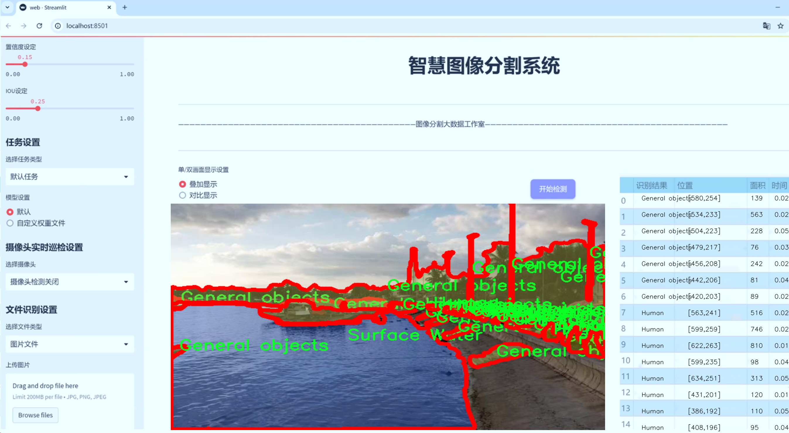
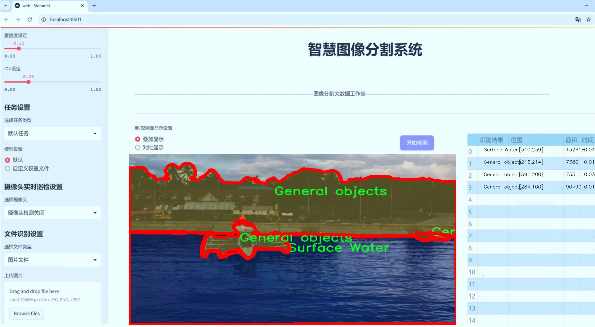
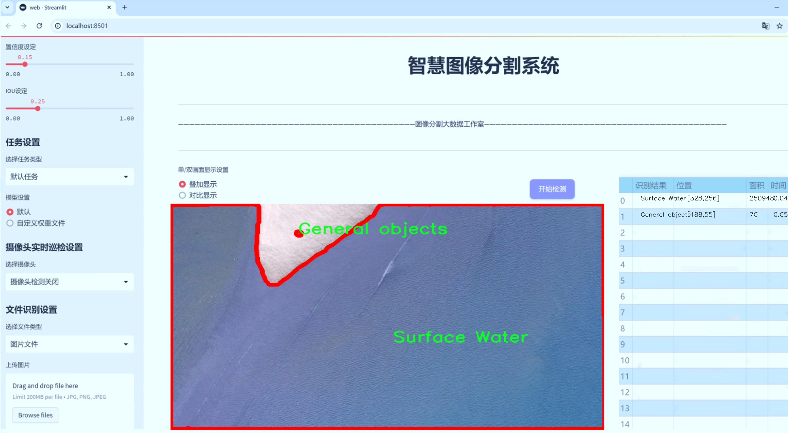
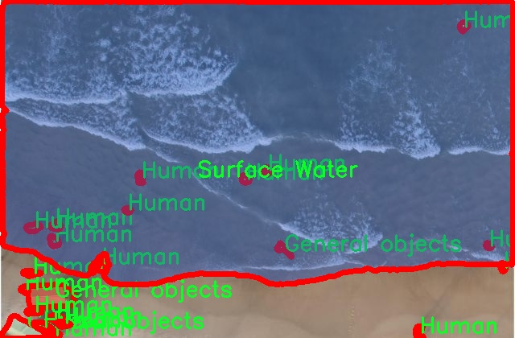
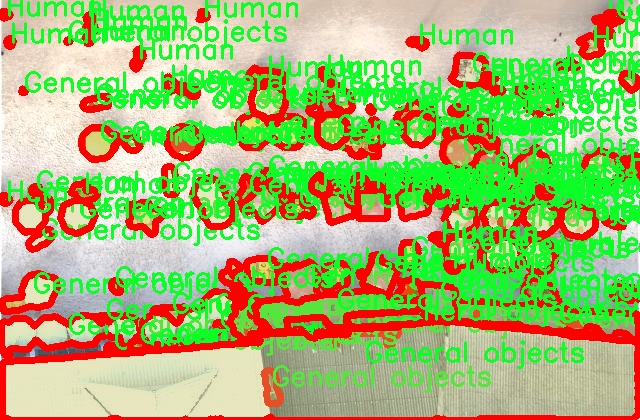
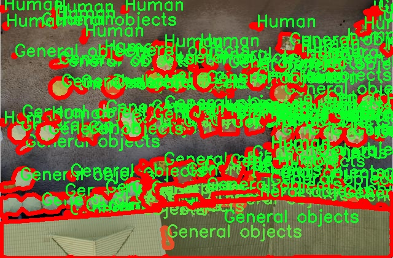
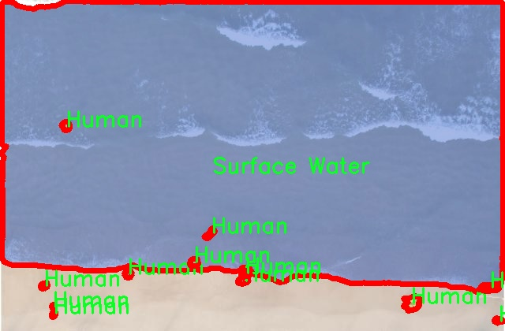
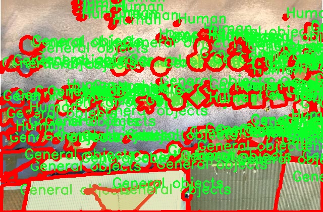

# 航拍海岸线游人海平面检测图像分割系统源码＆数据集分享
 [yolov8-seg-LAWDS＆yolov8-seg-C2f-EMBC等50+全套改进创新点发刊_一键训练教程_Web前端展示]

### 1.研究背景与意义

项目参考[ILSVRC ImageNet Large Scale Visual Recognition Challenge](https://gitee.com/YOLOv8_YOLOv11_Segmentation_Studio/projects)

项目来源[AAAI Global Al lnnovation Contest](https://kdocs.cn/l/cszuIiCKVNis)

研究背景与意义

随着全球气候变化和海平面上升的加剧，海岸线的变化已成为环境科学和地理信息系统研究中的一个重要课题。海岸线不仅是陆地与海洋的交界处，也是生态系统的重要组成部分，承载着丰富的生物多样性和人类活动。然而，随着城市化进程的加快，海岸线区域的游人活动日益频繁，这对海岸生态环境造成了显著影响。因此，开发一种高效的图像分割系统，以监测海岸线区域的游人和海平面变化，具有重要的科学研究和实际应用价值。

近年来，深度学习技术的迅猛发展为图像处理和分析提供了新的解决方案。YOLO（You Only Look Once）系列模型因其高效的实时目标检测能力而受到广泛关注。YOLOv8作为该系列的最新版本，进一步提升了检测精度和速度，适用于复杂环境下的目标识别和分割任务。在此背景下，基于改进YOLOv8的航拍海岸线游人海平面检测图像分割系统的研究，旨在利用先进的深度学习技术，实现对海岸线区域游人和海平面变化的自动化监测。

本研究所使用的数据集包含1400幅图像，涵盖了三类目标：一般物体、人体和水面。这些数据不仅为模型的训练提供了丰富的样本，还为后续的模型评估和应用提供了基础。通过对这些图像的分析，可以深入了解海岸线区域游人活动的分布特征以及水面变化的动态过程。尤其是在旅游高峰期，游人数量的激增可能对海岸生态环境造成压力，因此，实时监测游人数量和分布情况，对于制定合理的管理政策和保护措施至关重要。

此外，海平面变化对沿海地区的影响日益显著，特别是在极端天气事件频发的背景下，及时掌握海平面变化情况，有助于评估潜在的环境风险和制定应对策略。通过改进YOLOv8模型的图像分割能力，可以实现对海平面变化的精确检测，从而为科学研究和政策制定提供数据支持。

本研究的意义不仅在于技术层面的创新，更在于其对海岸线生态保护和可持续发展的贡献。通过建立高效的监测系统，可以为海岸线管理提供科学依据，帮助决策者及时采取措施，减缓人类活动对海岸生态环境的影响。同时，该系统的成功应用也为其他类似环境监测提供了借鉴，推动了智能监测技术在生态保护领域的广泛应用。

综上所述，基于改进YOLOv8的航拍海岸线游人海平面检测图像分割系统的研究，不仅具备重要的学术价值，还具有广泛的社会意义。通过该系统的开发与应用，能够有效提升海岸线监测的效率和准确性，为海岸生态环境的保护与可持续发展提供有力支持。

### 2.图片演示







##### 注意：由于此博客编辑较早，上面“2.图片演示”和“3.视频演示”展示的系统图片或者视频可能为老版本，新版本在老版本的基础上升级如下：（实际效果以升级的新版本为准）

  （1）适配了YOLOV8的“目标检测”模型和“实例分割”模型，通过加载相应的权重（.pt）文件即可自适应加载模型。

  （2）支持“图片识别”、“视频识别”、“摄像头实时识别”三种识别模式。

  （3）支持“图片识别”、“视频识别”、“摄像头实时识别”三种识别结果保存导出，解决手动导出（容易卡顿出现爆内存）存在的问题，识别完自动保存结果并导出到tempDir中。

  （4）支持Web前端系统中的标题、背景图等自定义修改，后面提供修改教程。

  另外本项目提供训练的数据集和训练教程,暂不提供权重文件（best.pt）,需要您按照教程进行训练后实现图片演示和Web前端界面演示的效果。

### 3.视频演示

[3.1 视频演示](https://www.bilibili.com/video/BV1DaSjYfEe5/)

### 4.数据集信息展示

##### 4.1 本项目数据集详细数据（类别数＆类别名）

nc: 3
names: ['General objects', 'Human', 'Surface Water']


##### 4.2 本项目数据集信息介绍

数据集信息展示

在现代计算机视觉领域，尤其是在图像分割和目标检测任务中，数据集的质量和多样性直接影响到模型的性能和泛化能力。为此，我们构建了一个名为“Coastline”的数据集，旨在为改进YOLOv8-seg的航拍海岸线游人海平面检测图像分割系统提供强有力的支持。该数据集专注于海岸线环境中的多种目标，特别是游人和水面，涵盖了丰富的场景和多样的对象特征，以确保模型在实际应用中的有效性和可靠性。

“Coastline”数据集包含三个主要类别，分别是“General objects”、“Human”和“Surface Water”。每个类别都经过精心标注，确保在训练过程中模型能够准确识别和分割不同类型的对象。“General objects”类别涵盖了海岸线环境中可能出现的各种物体，如沙滩椅、遮阳伞、垃圾桶等，这些物体在海岸线的场景中具有代表性，能够帮助模型学习到更多的上下文信息。通过引入这些一般物体，我们希望提升模型对复杂场景的理解能力，从而在多变的环境中保持较高的检测精度。

“Human”类别则专注于海岸线区域的人类活动，标注了在海滩上活动的游客、游泳者、冲浪者等。这一类别的引入不仅能够帮助模型识别和分割出人类个体，还能为后续的行为分析和人流量监测提供基础数据。随着海岸线游人数量的增加，准确识别和监测人类活动变得尤为重要，因此这一类别的标注显得尤为关键。

“Surface Water”类别则专注于海面及其变化，包括波浪、涟漪等水面特征。这一类别的引入使得模型能够在检测游人和其他物体的同时，理解水面与其他元素之间的关系。水面在航拍图像中往往具有较强的反射特性和动态变化，模型需要能够有效地处理这些复杂的视觉信息，以实现准确的图像分割。

“Coastline”数据集的构建不仅考虑了类别的多样性，还注重数据的丰富性和代表性。数据集中的图像均来自于不同的海岸线场景，涵盖了不同的天气条件、时间段和季节变化，确保模型在训练过程中能够接触到各种可能的视觉特征。这种多样性使得模型在面对实际应用时，能够更好地适应不同的环境变化，提升其鲁棒性和准确性。

总之，“Coastline”数据集为改进YOLOv8-seg的航拍海岸线游人海平面检测图像分割系统提供了坚实的基础。通过精心设计的类别和丰富的图像样本，该数据集不仅为模型的训练提供了高质量的数据支持，还为未来的研究和应用开辟了新的方向。我们相信，随着这一数据集的应用，航拍图像分析的准确性和效率将得到显著提升，为海岸线管理和保护提供更为有效的技术手段。











### 5.全套项目环境部署视频教程（零基础手把手教学）

[5.1 环境部署教程链接（零基础手把手教学）](https://www.bilibili.com/video/BV1jG4Ve4E9t/?vd_source=bc9aec86d164b67a7004b996143742dc)


[5.2 安装Python虚拟环境创建和依赖库安装视频教程链接（零基础手把手教学）](https://www.bilibili.com/video/BV1nA4VeYEze/?vd_source=bc9aec86d164b67a7004b996143742dc)

### 6.手把手YOLOV8-seg训练视频教程（零基础小白有手就能学会）

[6.1 手把手YOLOV8-seg训练视频教程（零基础小白有手就能学会）](https://www.bilibili.com/video/BV1cA4VeYETe/?vd_source=bc9aec86d164b67a7004b996143742dc)


按照上面的训练视频教程链接加载项目提供的数据集，运行train.py即可开始训练



     Epoch   gpu_mem       box       obj       cls    labels  img_size
     1/200     0G   0.01576   0.01955  0.007536        22      1280: 100%|██████████| 849/849 [14:42<00:00,  1.04s/it]
               Class     Images     Labels          P          R     mAP@.5 mAP@.5:.95: 100%|██████████| 213/213 [01:14<00:00,  2.87it/s]
                 all       3395      17314      0.994      0.957      0.0957      0.0843

     Epoch   gpu_mem       box       obj       cls    labels  img_size
     2/200     0G   0.01578   0.01923  0.007006        22      1280: 100%|██████████| 849/849 [14:44<00:00,  1.04s/it]
               Class     Images     Labels          P          R     mAP@.5 mAP@.5:.95: 100%|██████████| 213/213 [01:12<00:00,  2.95it/s]
                 all       3395      17314      0.996      0.956      0.0957      0.0845

     Epoch   gpu_mem       box       obj       cls    labels  img_size
     3/200     0G   0.01561    0.0191  0.006895        27      1280: 100%|██████████| 849/849 [10:56<00:00,  1.29it/s]
               Class     Images     Labels          P          R     mAP@.5 mAP@.5:.95: 100%|███████   | 187/213 [00:52<00:00,  4.04it/s]
                 all       3395      17314      0.996      0.957      0.0957      0.0845


### 7.50+种全套YOLOV8-seg创新点代码加载调参视频教程（一键加载写好的改进模型的配置文件）

[7.1 50+种全套YOLOV8-seg创新点代码加载调参视频教程（一键加载写好的改进模型的配置文件）](https://www.bilibili.com/video/BV1Hw4VePEXv/?vd_source=bc9aec86d164b67a7004b996143742dc)

### 8.YOLOV8-seg图像分割算法原理

原始YOLOV8-seg算法原理

YOLO（You Only Look Once）系列算法自其诞生以来，便在目标检测领域引领潮流，尤其是YOLOv8版本的推出，标志着这一系列算法在精度和速度上的进一步优化。YOLOv8-seg作为YOLOv8的一个扩展，专注于目标检测与实例分割的结合，旨在实现更高效、更准确的图像理解。其核心原理基于YOLOv8的架构，但在特征提取、特征融合和检测模块等方面进行了重要的创新和改进。

YOLOv8-seg的结构可以分为四个主要部分：输入层、Backbone骨干网络、Neck特征融合网络和Head检测模块。输入层负责对图像进行预处理，包括调整图像比例、Mosaic增强和瞄点计算等。这些预处理步骤不仅提高了模型的鲁棒性，还为后续的特征提取奠定了基础。

在Backbone部分，YOLOv8-seg延续了YOLOv5的CSPDarknet结构，但对C3模块进行了替换，采用了C2f模块。这一模块通过引入更多的跳层连接和Split操作，显著增强了梯度流动的能力，使得网络在训练过程中能够更有效地传递信息。此外，C2f模块的设计还考虑到了模型的轻量化，确保在保持高精度的同时，降低了计算复杂度。通过SPPF模块，YOLOv8-seg能够对输出特征图进行多尺度的池化处理，从而更好地融合不同尺度的特征信息，为后续的目标检测和分割提供了丰富的特征基础。

Neck部分采用了双塔结构，结合了特征金字塔网络（FPN）和路径聚合网络（PAN），进一步提升了特征融合的能力。这一结构能够有效地整合来自不同层次的特征，确保在进行目标检测时，既能利用高层特征提供的语义信息，又能借助低层特征捕捉到的细节信息。这种深度融合使得YOLOv8-seg在处理不同尺度的目标时，表现出色，尤其是在小目标检测和复杂场景中的表现尤为突出。

在Head检测模块中，YOLOv8-seg采用了解耦头的结构，取代了传统的耦合头设计。这一创新使得回归分支和分类分支能够独立优化，从而加速了模型的收敛速度。YOLOv8-seg的Head部分还引入了Anchor-Free的检测思想，摒弃了以往依赖锚框的方式，转而通过直接预测目标的边界框和类别信息来实现目标检测。这一转变不仅简化了模型的设计，还提高了检测的灵活性和准确性。

YOLOv8-seg在损失函数的设计上也进行了创新，采用了VFLLoss作为分类损失，DFLLoss和CIoULoss作为回归损失。这种多损失函数的组合，使得模型在训练过程中能够更好地平衡分类和回归任务的优化，进而提升整体的检测性能。尤其是在面对复杂背景和小目标时，YOLOv8-seg展现出了更强的适应能力和鲁棒性。

值得一提的是，YOLOv8-seg在样本匹配策略上也进行了改进，由静态匹配转变为Task-Aligned的Assigner匹配方式。这一变化使得模型在训练过程中能够更有效地对齐样本与任务，提高了训练效率和检测精度。

综上所述，YOLOv8-seg算法通过对YOLOv8的结构进行深度优化和创新，结合了先进的特征提取、融合和检测技术，展现出了在目标检测与实例分割任务中的卓越性能。其独特的设计理念和高效的实现方式，使得YOLOv8-seg不仅在学术研究中具有重要的参考价值，也为实际应用提供了强有力的支持。随着YOLOv8-seg的不断发展和完善，未来在计算机视觉领域的应用前景将更加广阔。


### 9.系统功能展示（检测对象为举例，实际内容以本项目数据集为准）

图9.1.系统支持检测结果表格显示

  图9.2.系统支持置信度和IOU阈值手动调节

  图9.3.系统支持自定义加载权重文件best.pt(需要你通过步骤5中训练获得)

  图9.4.系统支持摄像头实时识别

  图9.5.系统支持图片识别

  图9.6.系统支持视频识别

  图9.7.系统支持识别结果文件自动保存

  图9.8.系统支持Excel导出检测结果数据


### 10.50+种全套YOLOV8-seg创新点原理讲解（非科班也可以轻松写刊发刊，V11版本正在科研待更新）

#### 10.1 由于篇幅限制，每个创新点的具体原理讲解就不一一展开，具体见下列网址中的创新点对应子项目的技术原理博客网址【Blog】：


[10.1 50+种全套YOLOV8-seg创新点原理讲解链接](https://gitee.com/qunmasj/good)

#### 10.2 部分改进模块原理讲解(完整的改进原理见上图和技术博客链接)【如果此小节的图加载失败可以通过CSDN或者Github搜索该博客的标题访问原始博客，原始博客图片显示正常】
### YOLOv8算法原理
YOLOv8算法由Glenn-Jocher 提出，是跟YOLOv3算法、YOLOv5算法一脉相承的，主要的改进点如下:
(1)数据预处理。YOLOv8的数据预处理依旧采用YOLOv5的策略,在训练时，主要采用包括马赛克增强(Mosaic)、混合增强(Mixup)、空间扰动(randomperspective)以及颜色扰动(HSV augment)四个增强手段。
(2)骨干网络结构。YOLOv8的骨干网络结构可从YOLOv5略见一斑，YOLOv5的主干网络的架构规律十分清晰，总体来看就是每用一层步长为2的3×3卷积去降采样特征图，接一个C3模块来进一步强化其中的特征，且C3的基本深度参数分别为“3/6/9/3”，其会根据不同规模的模型的来做相应的缩放。在的YOLOv8中，大体上也还是继承了这一特点，原先的C3模块均被替换成了新的C2f模块，C2f 模块加入更多的分支，丰富梯度回传时的支流。下面展示了YOLOv8的C2f模块和YOLOv5的C3模块，其网络结构图所示。


(3)FPN-PAN结构。YOLOv8仍采用FPN+PAN结构来构建YOLO的特征金字塔，使多尺度信息之间进行充分的融合。除了FPN-PAN里面的C3模块被替换为C2f模块外，其余部分与YOLOv5的FPN-PAN结构基本一致。
(4)Detection head结构。从 YOLOv3到 YOLOv5，其检测头一直都是“耦合”(Coupled)的,即使用一层卷积同时完成分类和定位两个任务，直到YOLOX的问世， YOLO系列才第一次换装“解耦头”(Decoupled Head)。YOLOv8也同样也采用了解耦头的结构，两条并行的分支分别取提取类别特征和位置特征，然后各用一层1x1卷积完成分类和定位任务。YOLOv8整体的网络结构由图所示。


(5)标签分配策略。尽管YOLOv5设计了自动聚类候选框的一些功能，但是聚类候选框是依赖于数据集的。若数据集不够充分，无法较为准确地反映数据本身的分布特征，聚类出来的候选框也会与真实物体尺寸比例悬殊过大。YOLOv8没有采用候选框策略，所以解决的问题就是正负样本匹配的多尺度分配。不同于YOLOX所使用的 SimOTA，YOLOv8在标签分配问题上采用了和YOLOv6相同的TOOD策略，是一种动态标签分配策略。YOLOv8只用到了targetboze。和target scores，未含是否有物体预测，故 YOLOv8的损失就主要包括两大部分∶类别损失和位置损失。对于YOLOv8，其分类损失为VFLLoss(Varifocal Loss)，其回归损失为CIoU Loss 与 DFL Loss 的形式。
其中 Varifocal Loss定义如下:


其中p为预测的类别得分，p ∈ [0.1]。q为预测的目标分数(若为真实类别，则q为预测和真值的 loU;若为其他类别。q为0 )。VFL Loss使用不对称参数来对正负样本进行加权，通过只对负样本进行衰减，达到不对等的处理前景和背景对损失的贡献。对正样本，使用q进行了加权，如果正样本的GTiou很高时,则对损失的贡献更大一些，可以让网络聚焦于那些高质量的样本上，即训练高质量的正例对AP的提升比低质量的更大一些。对负样本，使用p进行了降权，降低了负例对损失的贡献，因负样本的预测p在取次幂后会变得更小，这样就能够降低负样本对损失的整体贡献。

### 动态蛇形卷积Dynamic Snake Convolution

参考论文： 2307.08388.pdf (arxiv.org)

血管、道路等拓扑管状结构的精确分割在各个领域都至关重要，确保下游任务的准确性和效率。 然而，许多因素使任务变得复杂，包括薄的局部结构和可变的全局形态。在这项工作中，我们注意到管状结构的特殊性，并利用这些知识来指导我们的 DSCNet 在三个阶段同时增强感知：特征提取、特征融合、 和损失约束。 首先，我们提出了一种动态蛇卷积，通过自适应地关注细长和曲折的局部结构来准确捕获管状结构的特征。 随后，我们提出了一种多视图特征融合策略，以补充特征融合过程中多角度对特征的关注，确保保留来自不同全局形态的重要信息。 最后，提出了一种基于持久同源性的连续性约束损失函数，以更好地约束分割的拓扑连续性。 2D 和 3D 数据集上的实验表明，与多种方法相比，我们的 DSCNet 在管状结构分割任务上提供了更好的准确性和连续性。 我们的代码是公开的。 
主要的挑战源于细长微弱的局部结构特征与复杂多变的全局形态特征。本文关注到管状结构细长连续的特点，并利用这一信息在神经网络以下三个阶段同时增强感知：特征提取、特征融合和损失约束。分别设计了动态蛇形卷积（Dynamic Snake Convolution），多视角特征融合策略与连续性拓扑约束损失。 

我们希望卷积核一方面能够自由地贴合结构学习特征，另一方面能够在约束条件下不偏离目标结构太远。在观察管状结构的细长连续的特征后，脑海里想到了一个动物——蛇。我们希望卷积核能够像蛇一样动态地扭动，来贴合目标的结构。

我们希望卷积核一方面能够自由地贴合结构学习特征，另一方面能够在约束条件下不偏离目标结构太远。在观察管状结构的细长连续的特征后，脑海里想到了一个动物——蛇。我们希望卷积核能够像蛇一样动态地扭动，来贴合目标的结构。


### DCNV2融入YOLOv8
DCN和DCNv2（可变性卷积）
网上关于两篇文章的详细描述已经很多了，我这里具体的细节就不多讲了，只说一下其中实现起来比较困惑的点。（黑体字会讲解）

DCNv1解决的问题就是我们常规的图像增强，仿射变换（线性变换加平移）不能解决的多种形式目标变换的几何变换的问题。如下图所示。

可变性卷积的思想很简单，就是讲原来固定形状的卷积核变成可变的。如下图所示：


首先来看普通卷积，以3x3卷积为例对于每个输出y(p0)，都要从x上采样9个位置，这9个位置都在中心位置x(p0)向四周扩散得到的gird形状上，(-1,-1)代表x(p0)的左上角，(1,1)代表x(p0)的右下角，其他类似。

用公式表示如下：


可变性卷积Deformable Conv操作并没有改变卷积的计算操作，而是在卷积操作的作用区域上，加入了一个可学习的参数∆pn。同样对于每个输出y(p0)，都要从x上采样9个位置，这9个位置是中心位置x(p0)向四周扩散得到的，但是多了 ∆pn，允许采样点扩散成非gird形状。


偏移量是通过对原始特征层进行卷积得到的。比如输入特征层是w×h×c，先对输入的特征层进行卷积操作，得到w×h×2c的offset field。这里的w和h和原始特征层的w和h是一致的，offset field里面的值是输入特征层对应位置的偏移量，偏移量有x和y两个方向，所以offset field的channel数是2c。offset field里的偏移量是卷积得到的，可能是浮点数，所以接下来需要通过双向性插值计算偏移位置的特征值。在偏移量的学习中，梯度是通过双线性插值来进行反向传播的。
看到这里是不是还是有点迷茫呢？那到底程序上面怎么实现呢？


事实上由上面的公式我们可以看得出来∆pn这个偏移量是加在原像素点上的，但是我们怎么样从代码上对原像素点加这个量呢？其实很简单，就是用一个普通的卷积核去跟输入图片（一般是输入的feature_map）卷积就可以了卷积核的数量是2N也就是23*3==18（前9个通道是x方向的偏移量，后9个是y方向的偏移量），然后把这个卷积的结果与正常卷积的结果进行相加就可以了。
然后又有了第二个问题，怎么样反向传播呢？为什么会有这个问题呢？因为求出来的偏移量+正常卷积输出的结果往往是一个浮点数，浮点数是无法对应到原图的像素点的，所以自然就想到了双线性差值的方法求出浮点数对应的浮点像素点。


#### DCN v2
对于positive的样本来说，采样的特征应该focus在RoI内，如果特征中包含了过多超出RoI的内容，那么结果会受到影响和干扰。而negative样本则恰恰相反，引入一些超出RoI的特征有助于帮助网络判别这个区域是背景区域。

DCNv1引入了可变形卷积，能更好的适应目标的几何变换。但是v1可视化结果显示其感受野对应位置超出了目标范围，导致特征不受图像内容影响（理想情况是所有的对应位置分布在目标范围以内）。

为了解决该问题：提出v2, 主要有

1、扩展可变形卷积，增强建模能力
2、提出了特征模拟方案指导网络培训：feature mimicking scheme

上面这段话是什么意思呢，通俗来讲就是，我们的可变性卷积的区域大于目标所在区域，所以这时候就会对非目标区域进行错误识别。

所以自然能想到的解决方案就是加入权重项进行惩罚。（至于这个实现起来就比较简单了，直接初始化一个权重然后乘(input+offsets)就可以了）


可调节的RoIpooling也是类似的，公式如下：


### 11.项目核心源码讲解（再也不用担心看不懂代码逻辑）

#### 11.1 ultralytics\nn\extra_modules\ops_dcnv3\modules\__init__.py

以下是对提供代码的逐文件分析和核心部分的保留，以及详细的中文注释：

```python
# --------------------------------------------------------
# InternImage
# 版权所有 (c) 2022 OpenGVLab
# 根据 MIT 许可证授权 [详细信息见 LICENSE]
# --------------------------------------------------------

# 从当前模块导入 DCNv3、DCNv3_pytorch 和 DCNv3_DyHead 类或函数
from .dcnv3 import DCNv3, DCNv3_pytorch, DCNv3_DyHead

# 注释：
# 1. 这段代码是一个模块的导入部分，属于一个名为 InternImage 的项目。
# 2. 使用了 MIT 许可证，意味着该项目可以自由使用和修改，但需要保留版权声明。
# 3. 从 dcnv3 模块中导入了三个核心组件：
#    - DCNv3: 可能是一个深度可分离卷积网络的实现。
#    - DCNv3_pytorch: 可能是 DCNv3 在 PyTorch 框架下的实现。
#    - DCNv3_DyHead: 可能是与 DCNv3 相关的动态头部模块，通常用于目标检测等任务。
```

以上是对代码的核心部分进行了保留，并添加了详细的中文注释，帮助理解每一行代码的功能和意义。

这个文件是一个Python模块的初始化文件，位于`ultralytics/nn/extra_modules/ops_dcnv3/modules/`目录下。它的主要作用是导入其他模块中的类或函数，以便在该模块中可以直接使用。

文件开头的注释部分包含了一些版权信息，表明这个项目是由OpenGVLab开发的，并且使用MIT许可证。这意味着该代码可以自由使用和修改，但需要遵循许可证的条款。

接下来的代码行通过`from`语句导入了三个对象：`DCNv3`、`DCNv3_pytorch`和`DCNv3_DyHead`。这些对象可能是定义在同一目录下的`dcnv3`模块中的类或函数。通过这种方式，用户在导入这个`__init__.py`模块时，可以直接访问这三个对象，而不需要单独导入`dcnv3`模块。

总的来说，这个文件的功能是将特定的类或函数暴露给外部，以便于在使用这个模块时能够方便地调用这些功能。

#### 11.2 ultralytics\nn\backbone\SwinTransformer.py

以下是简化后的代码，保留了核心部分，并附上详细的中文注释：

```python
import torch
import torch.nn as nn
import torch.nn.functional as F

class Mlp(nn.Module):
    """ 多层感知机（MLP）模块。 """

    def __init__(self, in_features, hidden_features=None, out_features=None, act_layer=nn.GELU, drop=0.):
        super().__init__()
        out_features = out_features or in_features  # 输出特征数，默认为输入特征数
        hidden_features = hidden_features or in_features  # 隐藏层特征数，默认为输入特征数
        self.fc1 = nn.Linear(in_features, hidden_features)  # 第一层线性变换
        self.act = act_layer()  # 激活函数
        self.fc2 = nn.Linear(hidden_features, out_features)  # 第二层线性变换
        self.drop = nn.Dropout(drop)  # Dropout层

    def forward(self, x):
        """ 前向传播函数。 """
        x = self.fc1(x)  # 线性变换
        x = self.act(x)  # 激活
        x = self.drop(x)  # Dropout
        x = self.fc2(x)  # 线性变换
        x = self.drop(x)  # Dropout
        return x


class WindowAttention(nn.Module):
    """ 基于窗口的多头自注意力模块。 """

    def __init__(self, dim, window_size, num_heads):
        super().__init__()
        self.dim = dim  # 输入通道数
        self.window_size = window_size  # 窗口大小
        self.num_heads = num_heads  # 注意力头数
        self.qkv = nn.Linear(dim, dim * 3)  # 线性变换生成Q、K、V
        self.softmax = nn.Softmax(dim=-1)  # Softmax层

    def forward(self, x):
        """ 前向传播函数。 """
        B, N, C = x.shape  # B: 批次大小, N: 窗口内的token数, C: 通道数
        qkv = self.qkv(x).reshape(B, N, 3, self.num_heads, C // self.num_heads).permute(2, 0, 3, 1, 4)
        q, k, v = qkv[0], qkv[1], qkv[2]  # 分离Q、K、V
        attn = (q @ k.transpose(-2, -1))  # 计算注意力权重
        attn = self.softmax(attn)  # 应用Softmax
        x = (attn @ v).transpose(1, 2).reshape(B, N, C)  # 加权求和
        return x


class SwinTransformerBlock(nn.Module):
    """ Swin Transformer块。 """

    def __init__(self, dim, num_heads, window_size=7):
        super().__init__()
        self.attn = WindowAttention(dim, window_size, num_heads)  # 注意力模块
        self.mlp = Mlp(dim)  # MLP模块

    def forward(self, x):
        """ 前向传播函数。 """
        x = self.attn(x)  # 通过注意力模块
        x = self.mlp(x)  # 通过MLP模块
        return x


class SwinTransformer(nn.Module):
    """ Swin Transformer主干网络。 """

    def __init__(self, depths, num_heads, embed_dim=96):
        super().__init__()
        self.layers = nn.ModuleList([
            SwinTransformerBlock(dim=embed_dim * 2 ** i, num_heads=num_heads[i])
            for i in range(len(depths))
        ])

    def forward(self, x):
        """ 前向传播函数。 """
        for layer in self.layers:
            x = layer(x)  # 逐层前向传播
        return x


def SwinTransformer_Tiny(weights=''):
    """ 创建Swin Transformer Tiny模型。 """
    model = SwinTransformer(depths=[2, 2, 6, 2], num_heads=[3, 6, 12, 24])  # 定义模型结构
    if weights:
        model.load_state_dict(torch.load(weights)['model'])  # 加载预训练权重
    return model
```

### 代码说明：
1. **Mlp类**：实现了一个多层感知机，包含两个线性层和一个激活函数，支持Dropout。
2. **WindowAttention类**：实现了窗口注意力机制，计算输入特征的注意力权重并生成输出。
3. **SwinTransformerBlock类**：定义了一个Swin Transformer块，包含一个窗口注意力层和一个MLP层。
4. **SwinTransformer类**：构建了整个Swin Transformer模型，包含多个Swin Transformer块。
5. **SwinTransformer_Tiny函数**：用于创建一个小型的Swin Transformer模型，并可选择加载预训练权重。

该代码展示了Swin Transformer的基本结构和功能，适合用于图像处理任务。

这个程序文件实现了Swin Transformer模型的核心组件，主要用于计算机视觉任务。Swin Transformer是一种层次化的视觉Transformer架构，采用了移动窗口机制以提高计算效率。

首先，文件导入了必要的库，包括PyTorch和一些辅助函数。接着定义了一个多层感知机（Mlp）类，包含两个全连接层和一个激活函数（默认为GELU），用于特征转换。

接下来，定义了窗口划分和窗口逆转的函数，这两个函数用于将输入特征图划分为小窗口，并在计算注意力后将结果合并回原始特征图。这是Swin Transformer的关键机制之一，允许模型在局部窗口内进行自注意力计算。

然后，定义了窗口注意力（WindowAttention）类，该类实现了基于窗口的多头自注意力机制。它支持相对位置偏置，能够有效捕捉局部特征。该类的前向传播方法计算查询、键、值，并应用注意力机制，最后输出经过投影的特征。

接着，定义了Swin Transformer块（SwinTransformerBlock），它包含了归一化层、窗口注意力层和多层感知机。该块的前向传播方法实现了特征的归一化、窗口划分、注意力计算、窗口合并和最终的特征融合。

接下来是PatchMerging类，它用于将特征图中的补丁合并，降低特征图的分辨率。这个过程在Swin Transformer的不同阶段中进行，以逐步提取更高层次的特征。

BasicLayer类表示Swin Transformer的基本层，包含多个Swin Transformer块，并在必要时进行下采样。它计算了注意力掩码，并通过循环调用块的前向传播方法来处理输入特征。

PatchEmbed类负责将输入图像划分为补丁并进行嵌入，使用卷积层将补丁映射到高维空间。

最后，SwinTransformer类是整个模型的实现，负责构建各个层并处理输入数据。它包含了位置嵌入、dropout层以及多个基本层，并在前向传播中依次处理输入特征。

文件的最后部分定义了一个更新权重的函数，用于加载预训练模型的权重，并定义了一个SwinTransformer_Tiny函数，用于创建一个小型的Swin Transformer模型实例，并可选择加载权重。

总体来说，这个文件实现了Swin Transformer的主要结构和功能，适用于各种计算机视觉任务，如图像分类、目标检测等。

#### 11.3 ultralytics\utils\patches.py

以下是经过简化和注释的核心代码部分：

```python
import cv2
import numpy as np
import torch

def imread(filename: str, flags: int = cv2.IMREAD_COLOR):
    """
    从文件中读取图像。

    参数:
        filename (str): 要读取的文件路径。
        flags (int, optional): 读取标志，默认为 cv2.IMREAD_COLOR。

    返回:
        (np.ndarray): 读取的图像。
    """
    # 使用 cv2.imdecode 读取图像，支持多种文件格式
    return cv2.imdecode(np.fromfile(filename, np.uint8), flags)

def imwrite(filename: str, img: np.ndarray, params=None):
    """
    将图像写入文件。

    参数:
        filename (str): 要写入的文件路径。
        img (np.ndarray): 要写入的图像。
        params (list of ints, optional): 额外参数，参考 OpenCV 文档。

    返回:
        (bool): 如果文件写入成功返回 True，否则返回 False。
    """
    try:
        # 使用 cv2.imencode 将图像编码并写入文件
        cv2.imencode(Path(filename).suffix, img, params)[1].tofile(filename)
        return True
    except Exception:
        return False

def imshow(winname: str, mat: np.ndarray):
    """
    在指定窗口中显示图像。

    参数:
        winname (str): 窗口名称。
        mat (np.ndarray): 要显示的图像。
    """
    # 使用 cv2.imshow 显示图像，窗口名称进行编码以避免字符问题
    cv2.imshow(winname.encode('unicode_escape').decode(), mat)

def torch_save(*args, **kwargs):
    """
    使用 dill 序列化 lambda 函数（如果存在），以解决 pickle 无法处理的情况。

    参数:
        *args (tuple): 传递给 torch.save 的位置参数。
        **kwargs (dict): 传递给 torch.save 的关键字参数。
    """
    try:
        import dill as pickle  # 尝试导入 dill
    except ImportError:
        import pickle  # 如果没有，则使用标准的 pickle

    # 如果没有指定 pickle_module，则使用导入的 pickle
    if 'pickle_module' not in kwargs:
        kwargs['pickle_module'] = pickle
    return torch.save(*args, **kwargs)  # 调用原始的 torch.save
```

### 代码说明：
1. **imread**: 该函数用于从指定路径读取图像文件，支持多种格式，并返回图像的 NumPy 数组表示。
2. **imwrite**: 该函数将 NumPy 数组表示的图像写入指定的文件路径，支持不同的图像格式，返回写入是否成功的布尔值。
3. **imshow**: 该函数在一个窗口中显示图像，窗口名称经过编码以避免字符编码问题。
4. **torch_save**: 该函数扩展了 PyTorch 的保存功能，允许使用 `dill` 序列化 lambda 函数，确保可以保存更复杂的对象。

这个程序文件是一个用于扩展和更新现有功能的“猴子补丁”模块，主要涉及图像处理和PyTorch的功能增强。文件的开头包含了版权信息，说明该文件属于Ultralytics YOLO项目，并遵循AGPL-3.0许可证。

首先，文件导入了必要的库，包括`Path`（用于处理文件路径）、`cv2`（OpenCV库，用于图像处理）、`numpy`（用于数组操作）和`torch`（用于深度学习框架PyTorch）。

接下来，文件定义了一些图像处理的函数，这些函数对OpenCV的功能进行了封装，以便更好地处理多语言环境下的图像文件。

`imread`函数用于从指定路径读取图像文件。它接受两个参数：文件名和读取标志，默认情况下使用`cv2.IMREAD_COLOR`来读取彩色图像。函数内部使用`cv2.imdecode`和`np.fromfile`来读取图像数据，并返回一个NumPy数组。

`imwrite`函数用于将图像写入文件。它接受三个参数：文件名、要写入的图像（NumPy数组）和可选的参数列表。函数尝试使用`cv2.imencode`将图像编码并写入文件，如果成功则返回`True`，否则返回`False`。

`imshow`函数用于在指定窗口中显示图像。它接受两个参数：窗口名称和要显示的图像。该函数调用了之前定义的`_imshow`（OpenCV的`imshow`函数的副本），并通过编码处理窗口名称，以避免潜在的递归错误。

在PyTorch相关的部分，文件定义了一个名为`torch_save`的函数，用于保存模型或数据。这个函数的目的是使用`dill`库（如果存在）来序列化那些`pickle`无法处理的lambda函数。函数接受任意数量的位置参数和关键字参数，并在没有指定`pickle_module`的情况下，将其设置为`pickle`。最后，调用了`_torch_save`来执行实际的保存操作。

总体而言，这个文件通过对OpenCV和PyTorch的功能进行封装和扩展，提供了更为灵活和强大的图像处理及模型保存功能，特别是在处理多语言环境和特殊数据类型时。

#### 11.4 ultralytics\engine\trainer.py

以下是经过简化并添加详细中文注释的核心代码部分：

```python
class BaseTrainer:
    """
    BaseTrainer类用于创建训练器的基类。

    属性:
        args (SimpleNamespace): 训练器的配置。
        model (nn.Module): 模型实例。
        device (torch.device): 用于训练的设备。
        trainset (torch.utils.data.Dataset): 训练数据集。
        testset (torch.utils.data.Dataset): 测试数据集。
        optimizer (torch.optim.Optimizer): 优化器实例。
        scheduler (torch.optim.lr_scheduler._LRScheduler): 学习率调度器。
    """

    def __init__(self, cfg=DEFAULT_CFG, overrides=None):
        """
        初始化BaseTrainer类。

        参数:
            cfg (str, optional): 配置文件路径，默认为DEFAULT_CFG。
            overrides (dict, optional): 配置覆盖，默认为None。
        """
        self.args = get_cfg(cfg, overrides)  # 获取配置
        self.device = select_device(self.args.device, self.args.batch)  # 选择设备
        self.model = None  # 初始化模型
        self.trainset, self.testset = None, None  # 初始化数据集
        self.optimizer = None  # 初始化优化器
        self.scheduler = None  # 初始化学习率调度器

    def train(self):
        """开始训练过程。"""
        # 设置多GPU训练的世界大小
        world_size = len(self.args.device.split(',')) if isinstance(self.args.device, str) else 1

        if world_size > 1 and 'LOCAL_RANK' not in os.environ:
            # 如果是多GPU训练，生成DDP命令并运行
            cmd, file = generate_ddp_command(world_size, self)
            subprocess.run(cmd, check=True)  # 执行命令
        else:
            self._do_train(world_size)  # 单GPU训练

    def _do_train(self, world_size=1):
        """执行训练过程。"""
        self._setup_train(world_size)  # 设置训练参数
        for epoch in range(self.args.epochs):
            self.model.train()  # 设置模型为训练模式
            for i, batch in enumerate(self.train_loader):  # 遍历训练数据
                self.optimizer.zero_grad()  # 清空梯度
                loss = self.model(batch)  # 前向传播
                loss.backward()  # 反向传播
                self.optimizer.step()  # 更新参数

    def _setup_train(self, world_size):
        """设置训练所需的参数和数据加载器。"""
        self.model = self.get_model()  # 获取模型
        self.train_loader = self.get_dataloader(self.trainset)  # 获取训练数据加载器
        self.optimizer = self.build_optimizer(self.model)  # 构建优化器
        self.scheduler = self.build_scheduler(self.optimizer)  # 构建学习率调度器

    def get_model(self):
        """加载或创建模型。"""
        # 这里可以根据需要实现模型的加载逻辑
        pass

    def get_dataloader(self, dataset):
        """返回数据加载器。"""
        # 这里可以根据需要实现数据加载器的构建逻辑
        pass

    def build_optimizer(self, model):
        """构建优化器。"""
        return optim.Adam(model.parameters(), lr=self.args.lr)  # 使用Adam优化器

    def build_scheduler(self, optimizer):
        """构建学习率调度器。"""
        return optim.lr_scheduler.StepLR(optimizer, step_size=10, gamma=0.1)  # 每10个epoch学习率衰减
```

### 代码说明：
1. **BaseTrainer类**：这是一个训练器的基类，包含了训练所需的基本属性和方法。
2. **__init__方法**：初始化训练器的配置、设备、模型和数据集等。
3. **train方法**：开始训练过程，支持多GPU训练。
4. **_do_train方法**：执行训练过程，遍历每个epoch和每个batch，进行前向传播和反向传播。
5. **_setup_train方法**：设置训练所需的参数和数据加载器。
6. **get_model、get_dataloader、build_optimizer、build_scheduler方法**：这些方法用于获取模型、构建数据加载器、优化器和学习率调度器。

以上代码为训练过程的核心部分，包含了训练的基本框架和逻辑。

这个程序文件 `ultralytics/engine/trainer.py` 是用于训练 YOLO（You Only Look Once）模型的基础类，主要负责模型的训练过程，包括数据加载、模型设置、优化器配置、训练循环等功能。文件中定义了一个名为 `BaseTrainer` 的类，下面是对其主要部分的详细说明。

首先，文件导入了一系列必要的库和模块，包括数学运算、文件操作、时间处理、PyTorch 相关模块等。这些库提供了模型训练所需的基础功能，如张量运算、分布式训练、数据加载等。

`BaseTrainer` 类的构造函数 `__init__` 初始化了一些重要的属性，包括训练参数、模型、数据集、优化器等。它使用 `get_cfg` 函数获取配置，并检查是否需要从之前的检查点恢复训练。设备选择通过 `select_device` 函数进行，确保模型在适当的硬件上运行（如 GPU 或 CPU）。

在初始化过程中，类还会创建保存结果的目录，并保存当前的配置参数到 YAML 文件中。模型和数据集的检查通过 `check_cls_dataset` 和 `check_det_dataset` 函数完成，以确保数据集格式正确。

`train` 方法是训练的入口，首先判断当前设备的数量，以决定是否使用分布式数据并行（DDP）训练。如果是多 GPU 训练，生成相应的命令并通过子进程运行；否则，直接调用 `_do_train` 方法进行训练。

`_setup_ddp` 方法用于初始化分布式训练的参数，而 `_setup_train` 方法则构建数据加载器和优化器，并设置模型的属性。训练过程中会对模型的层进行冻结，以便于进行微调。

`_do_train` 方法是训练的核心部分，负责管理训练循环。它记录每个 epoch 的开始和结束时间，更新模型参数，计算损失，并进行验证。训练过程中，模型会根据指定的学习率调度器调整学习率，并在每个 epoch 结束时进行验证和模型保存。

模型的保存通过 `save_model` 方法实现，该方法会保存当前的模型状态、优化器状态和训练参数等信息，以便后续恢复训练或进行评估。

此外，类中还定义了一些辅助方法，如 `validate` 用于在验证集上评估模型性能，`build_optimizer` 用于构建优化器，`preprocess_batch` 用于对输入数据进行预处理等。

总的来说，这个文件实现了 YOLO 模型训练的基本框架，提供了灵活的配置和扩展能力，适用于各种目标检测任务。

#### 11.5 ultralytics\nn\extra_modules\orepa.py

以下是简化后的核心代码部分，并附有详细的中文注释：

```python
import torch
import torch.nn as nn
import torch.nn.functional as F
import numpy as np

# 定义一个用于转换卷积核和批归一化的函数
def transI_fusebn(kernel, bn):
    # 获取批归一化的参数
    gamma = bn.weight
    std = (bn.running_var + bn.eps).sqrt()  # 计算标准差
    # 返回转换后的卷积核和偏置
    return kernel * ((gamma / std).reshape(-1, 1, 1, 1)), bn.bias - bn.running_mean * gamma / std

# 定义OREPA模块
class OREPA(nn.Module):
    def __init__(self, in_channels, out_channels, kernel_size=3, stride=1, padding=None, groups=1, dilation=1, act=True):
        super(OREPA, self).__init__()
        self.nonlinear = nn.ReLU() if act else nn.Identity()  # 激活函数选择
        self.weight_orepa_origin = nn.Parameter(torch.Tensor(out_channels, in_channels // groups, kernel_size, kernel_size))  # 原始卷积核
        nn.init.kaiming_uniform_(self.weight_orepa_origin)  # 权重初始化

        # 其他权重的初始化
        self.weight_orepa_avg_conv = nn.Parameter(torch.Tensor(out_channels, in_channels // groups, 1, 1))
        nn.init.kaiming_uniform_(self.weight_orepa_avg_conv)
        
        self.bn = nn.BatchNorm2d(out_channels)  # 批归一化层

    def weight_gen(self):
        # 生成权重
        weight_orepa_origin = self.weight_orepa_origin  # 原始卷积核
        weight_orepa_avg = self.weight_orepa_avg_conv  # 平均卷积核
        weight = weight_orepa_origin + weight_orepa_avg  # 合并权重
        return weight

    def forward(self, inputs):
        weight = self.weight_gen()  # 生成权重
        out = F.conv2d(inputs, weight, stride=1, padding=1)  # 卷积操作
        return self.nonlinear(self.bn(out))  # 应用激活函数和批归一化

# 定义RepVGGBlock_OREPA模块
class RepVGGBlock_OREPA(nn.Module):
    def __init__(self, in_channels, out_channels, kernel_size=3, stride=1, act=True):
        super(RepVGGBlock_OREPA, self).__init__()
        self.nonlinearity = nn.ReLU() if act else nn.Identity()  # 激活函数选择
        self.rbr_dense = OREPA(in_channels, out_channels, kernel_size=kernel_size, stride=stride)  # OREPA模块
        self.rbr_1x1 = nn.Conv2d(in_channels, out_channels, kernel_size=1)  # 1x1卷积

    def forward(self, inputs):
        out1 = self.rbr_dense(inputs)  # 通过OREPA模块
        out2 = self.rbr_1x1(inputs)  # 通过1x1卷积
        out = out1 + out2  # 合并输出
        return self.nonlinearity(out)  # 应用激活函数

# 示例使用
# model = RepVGGBlock_OREPA(in_channels=64, out_channels=128)
# output = model(torch.randn(1, 64, 32, 32))  # 输入一个随机张量
```

### 代码说明：
1. **transI_fusebn**: 该函数用于将卷积核与批归一化层的参数结合，返回融合后的卷积核和偏置。
2. **OREPA类**: 这是一个自定义的卷积模块，包含多个卷积核和批归一化。它在初始化时设置卷积核的权重，并在前向传播中执行卷积操作。
3. **RepVGGBlock_OREPA类**: 这是一个复合模块，包含一个OREPA模块和一个1x1卷积层。它在前向传播中将两个输出相加，并应用激活函数。

通过这种方式，代码的核心功能得以保留，同时注释帮助理解每个部分的作用。

这个程序文件`orepa.py`是一个深度学习模型的实现，主要用于构建一种名为OREPA（Optimized Reparameterization for Efficient Convolution）的卷积层。该文件中包含多个类和函数，主要功能是实现不同类型的卷积操作和参数重参数化，以提高模型的效率和性能。

首先，文件中导入了一些必要的库，包括`torch`、`torch.nn`、`torch.nn.functional`等，这些库提供了构建神经网络所需的基本组件和功能。接着，定义了一些辅助函数，如`transI_fusebn`和`transVI_multiscale`，用于处理卷积核和批归一化（Batch Normalization）参数的转换，以及对卷积核进行多尺度填充。

`OREPA`类是文件的核心部分，它继承自`nn.Module`，表示一个可训练的神经网络模块。在初始化方法中，类接收多个参数，包括输入和输出通道数、卷积核大小、步幅、填充、分组卷积等。根据这些参数，类内部会初始化多个卷积核和相关的参数，并使用Kaiming均匀分布进行初始化。

`OREPA`类中还定义了多个方法，包括`weight_gen`用于生成最终的卷积权重，`forward`方法用于定义前向传播过程，`switch_to_deploy`方法用于将模型切换到推理模式，以便在部署时使用优化后的卷积层。

`OREPA_LargeConv`类和`RepVGGBlock_OREPA`类则是对`OREPA`类的扩展，分别实现了大卷积层和特定结构的卷积块。这些类同样继承自`nn.Module`，并在其内部实现了相应的卷积操作和参数处理逻辑。

整个文件的设计旨在通过灵活的参数重参数化和高效的卷积实现，来提升深度学习模型的性能和计算效率，适用于需要高效推理的场景。

### 12.系统整体结构（节选）

### 程序整体功能和构架概括

该程序是一个深度学习框架，主要用于实现和训练计算机视觉模型，特别是目标检测和图像分类任务。它包含多个模块和文件，各自负责不同的功能。整体架构可以分为以下几个部分：

1. **模型定义**：包括不同类型的神经网络架构，如Swin Transformer和OREPA卷积层。这些模型实现了先进的计算机视觉算法，具有高效的特征提取能力。

2. **训练引擎**：`trainer.py`文件负责模型的训练过程，包括数据加载、优化器配置、训练循环和模型保存等功能。它提供了灵活的训练配置，支持分布式训练。

3. **工具函数**：`patches.py`文件提供了一些实用的工具函数，用于图像处理和模型保存，增强了框架的灵活性和易用性。

4. **扩展模块**：`__init__.py`和`orepa.py`文件包含了一些额外的模块和功能，扩展了模型的能力，支持不同的卷积操作和参数重参数化。

### 文件功能整理表

| 文件路径                                            | 功能描述                                                                                   |
|-----------------------------------------------------|-------------------------------------------------------------------------------------------|
| `ultralytics/nn/extra_modules/ops_dcnv3/modules/__init__.py` | 初始化模块，导入DCNv3相关的类和函数，以便于外部使用。                                         |
| `ultralytics/nn/backbone/SwinTransformer.py`      | 实现Swin Transformer模型，包括多层感知机、窗口注意力机制、特征提取和模型构建等功能。                |
| `ultralytics/utils/patches.py`                     | 提供图像处理和模型保存的工具函数，封装OpenCV和PyTorch的功能，增强图像读取和写入的灵活性。         |
| `ultralytics/engine/trainer.py`                    | 实现模型训练的基础类，管理训练循环、数据加载、优化器配置和模型保存，支持分布式训练。               |
| `ultralytics/nn/extra_modules/orepa.py`           | 实现OREPA卷积层，提供高效的卷积操作和参数重参数化功能，旨在提升深度学习模型的性能和计算效率。     |

以上表格总结了每个文件的主要功能，展示了程序的整体架构和模块化设计。通过这些模块的协同工作，程序能够高效地实现计算机视觉任务。

注意：由于此博客编辑较早，上面“11.项目核心源码讲解（再也不用担心看不懂代码逻辑）”中部分代码可能会优化升级，仅供参考学习，完整“训练源码”、“Web前端界面”和“50+种创新点源码”以“14.完整训练+Web前端界面+50+种创新点源码、数据集获取”的内容为准。

### 13.图片、视频、摄像头图像分割Demo(去除WebUI)代码

在这个博客小节中，我们将讨论如何在不使用WebUI的情况下，实现图像分割模型的使用。本项目代码已经优化整合，方便用户将分割功能嵌入自己的项目中。
核心功能包括图片、视频、摄像头图像的分割，ROI区域的轮廓提取、类别分类、周长计算、面积计算、圆度计算以及颜色提取等。
这些功能提供了良好的二次开发基础。

### 核心代码解读

以下是主要代码片段，我们会为每一块代码进行详细的批注解释：

```python
import random
import cv2
import numpy as np
from PIL import ImageFont, ImageDraw, Image
from hashlib import md5
from model import Web_Detector
from chinese_name_list import Label_list

# 根据名称生成颜色
def generate_color_based_on_name(name):
    ......

# 计算多边形面积
def calculate_polygon_area(points):
    return cv2.contourArea(points.astype(np.float32))

...
# 绘制中文标签
def draw_with_chinese(image, text, position, font_size=20, color=(255, 0, 0)):
    image_pil = Image.fromarray(cv2.cvtColor(image, cv2.COLOR_BGR2RGB))
    draw = ImageDraw.Draw(image_pil)
    font = ImageFont.truetype("simsun.ttc", font_size, encoding="unic")
    draw.text(position, text, font=font, fill=color)
    return cv2.cvtColor(np.array(image_pil), cv2.COLOR_RGB2BGR)

# 动态调整参数
def adjust_parameter(image_size, base_size=1000):
    max_size = max(image_size)
    return max_size / base_size

# 绘制检测结果
def draw_detections(image, info, alpha=0.2):
    name, bbox, conf, cls_id, mask = info['class_name'], info['bbox'], info['score'], info['class_id'], info['mask']
    adjust_param = adjust_parameter(image.shape[:2])
    spacing = int(20 * adjust_param)

    if mask is None:
        x1, y1, x2, y2 = bbox
        aim_frame_area = (x2 - x1) * (y2 - y1)
        cv2.rectangle(image, (x1, y1), (x2, y2), color=(0, 0, 255), thickness=int(3 * adjust_param))
        image = draw_with_chinese(image, name, (x1, y1 - int(30 * adjust_param)), font_size=int(35 * adjust_param))
        y_offset = int(50 * adjust_param)  # 类别名称上方绘制，其下方留出空间
    else:
        mask_points = np.concatenate(mask)
        aim_frame_area = calculate_polygon_area(mask_points)
        mask_color = generate_color_based_on_name(name)
        try:
            overlay = image.copy()
            cv2.fillPoly(overlay, [mask_points.astype(np.int32)], mask_color)
            image = cv2.addWeighted(overlay, 0.3, image, 0.7, 0)
            cv2.drawContours(image, [mask_points.astype(np.int32)], -1, (0, 0, 255), thickness=int(8 * adjust_param))

            # 计算面积、周长、圆度
            area = cv2.contourArea(mask_points.astype(np.int32))
            perimeter = cv2.arcLength(mask_points.astype(np.int32), True)
            ......

            # 计算色彩
            mask = np.zeros(image.shape[:2], dtype=np.uint8)
            cv2.drawContours(mask, [mask_points.astype(np.int32)], -1, 255, -1)
            color_points = cv2.findNonZero(mask)
            ......

            # 绘制类别名称
            x, y = np.min(mask_points, axis=0).astype(int)
            image = draw_with_chinese(image, name, (x, y - int(30 * adjust_param)), font_size=int(35 * adjust_param))
            y_offset = int(50 * adjust_param)

            # 绘制面积、周长、圆度和色彩值
            metrics = [("Area", area), ("Perimeter", perimeter), ("Circularity", circularity), ("Color", color_str)]
            for idx, (metric_name, metric_value) in enumerate(metrics):
                ......

    return image, aim_frame_area

# 处理每帧图像
def process_frame(model, image):
    pre_img = model.preprocess(image)
    pred = model.predict(pre_img)
    det = pred[0] if det is not None and len(det)
    if det:
        det_info = model.postprocess(pred)
        for info in det_info:
            image, _ = draw_detections(image, info)
    return image

if __name__ == "__main__":
    cls_name = Label_list
    model = Web_Detector()
    model.load_model("./weights/yolov8s-seg.pt")

    # 摄像头实时处理
    cap = cv2.VideoCapture(0)
    while cap.isOpened():
        ret, frame = cap.read()
        if not ret:
            break
        ......

    # 图片处理
    image_path = './icon/OIP.jpg'
    image = cv2.imread(image_path)
    if image is not None:
        processed_image = process_frame(model, image)
        ......

    # 视频处理
    video_path = ''  # 输入视频的路径
    cap = cv2.VideoCapture(video_path)
    while cap.isOpened():
        ret, frame = cap.read()
        ......
```


### 14.完整训练+Web前端界面+50+种创新点源码、数据集获取


# [下载链接：https://mbd.pub/o/bread/Zp6Ym59s](https://mbd.pub/o/bread/Zp6Ym59s)